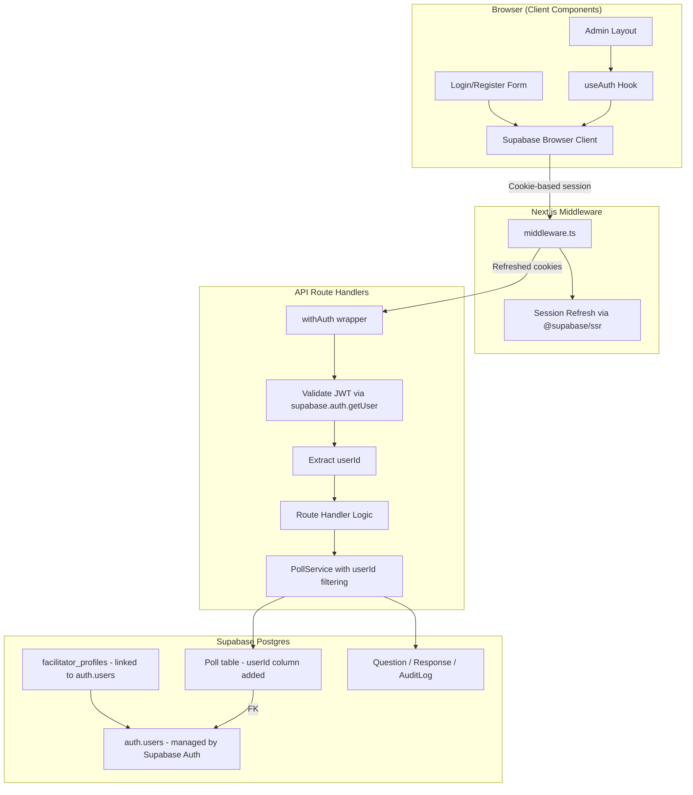
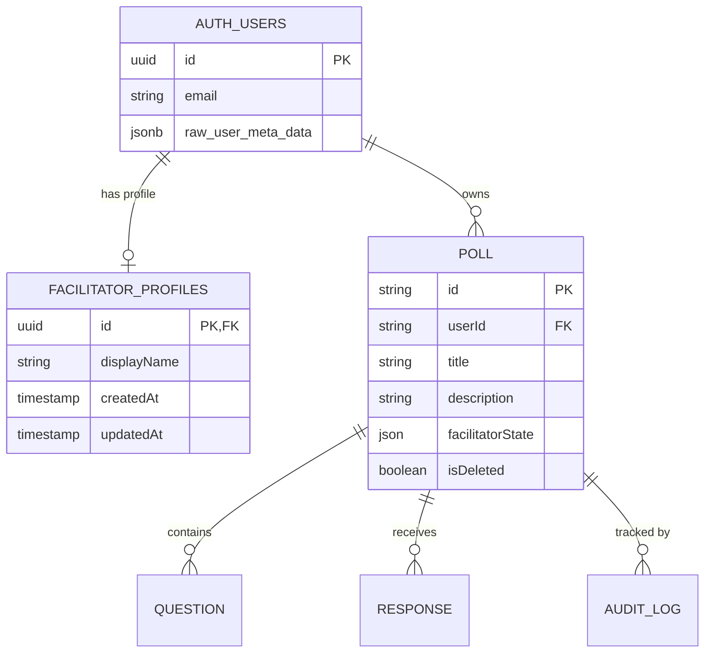

# Design Document: Multi-Tenant Facilitator Auth

## Overview

This design replaces SprintPulse's shared `ADMIN_SECRET` token authentication with individual Supabase Auth accounts for each facilitator. The system uses `@supabase/ssr` for cookie-based session management in Next.js 14+ App Router, a `facilitator_profiles` table linked to `auth.users`, and a `userId` column on the `Poll` table for ownership enforcement. Participant access remains fully unauthenticated.

Key design decisions:
- **Supabase Auth with `@supabase/ssr`** over custom JWT handling — leverages built-in session refresh, cookie management, and the existing Supabase infrastructure already in the project.
- **Prisma for application tables, raw SQL migration for auth-linked table** — the `facilitator_profiles` table references `auth.users` (managed by Supabase), so it's created via SQL migration. The `Poll.userId` column is added via Prisma migration.
- **Server-side token validation in route handlers** — replaces the `withAdminAuth` HOF with a `withAuth` wrapper that validates the Supabase JWT and extracts the user ID.
- **No RLS on application tables** — ownership enforcement happens at the application layer (service/middleware) since the app uses Prisma with a service-role connection string, not the Supabase PostgREST API.

## Architecture



### Request Flow

1. **Client** sends request with session cookie (set by `@supabase/ssr`)
2. **Next.js Middleware** refreshes the session token if needed, passes updated cookies
3. **API Route** uses `withAuth` wrapper to validate the token server-side via `supabase.auth.getUser()`
4. **Route Handler** receives the authenticated `userId` and passes it to services
5. **Services** filter data by `userId` for ownership enforcement

## Components and Interfaces

### 1. Supabase Client Utilities (`lib/supabase/`)

**`lib/supabase/client.ts`** — Browser client (singleton pattern via `createBrowserClient`)
```typescript
import { createBrowserClient } from '@supabase/ssr';

export function createClient() {
  return createBrowserClient(
    process.env.NEXT_PUBLIC_SUPABASE_URL!,
    process.env.NEXT_PUBLIC_SUPABASE_ANON_KEY!
  );
}
```

**`lib/supabase/server.ts`** — Server client for Route Handlers and Server Components
```typescript
import { createServerClient } from '@supabase/ssr';
import { cookies } from 'next/headers';

export async function createClient() {
  const cookieStore = await cookies();
  return createServerClient(
    process.env.NEXT_PUBLIC_SUPABASE_URL!,
    process.env.NEXT_PUBLIC_SUPABASE_ANON_KEY!,
    {
      cookies: {
        getAll() { return cookieStore.getAll(); },
        setAll(cookiesToSet) {
          try {
            cookiesToSet.forEach(({ name, value, options }) =>
              cookieStore.set(name, value, options)
            );
          } catch { /* Called from Server Component — ignored */ }
        },
      },
    }
  );
}
```

**`lib/supabase/middleware.ts`** — Session refresh logic for Next.js middleware
```typescript
import { createServerClient } from '@supabase/ssr';
import { NextResponse, type NextRequest } from 'next/server';

export async function updateSession(request: NextRequest) {
  let supabaseResponse = NextResponse.next({ request });
  const supabase = createServerClient(
    process.env.NEXT_PUBLIC_SUPABASE_URL!,
    process.env.NEXT_PUBLIC_SUPABASE_ANON_KEY!,
    {
      cookies: {
        getAll() { return request.cookies.getAll(); },
        setAll(cookiesToSet) {
          cookiesToSet.forEach(({ name, value }) => request.cookies.set(name, value));
          supabaseResponse = NextResponse.next({ request });
          cookiesToSet.forEach(({ name, value, options }) =>
            supabaseResponse.cookies.set(name, value, options)
          );
        },
      },
    }
  );
  await supabase.auth.getUser();
  return supabaseResponse;
}
```

### 2. Auth Middleware (`middleware.ts` at project root)

Replaces the current absence of a Next.js middleware file. Refreshes auth sessions on every request to protected routes.

```typescript
import { type NextRequest } from 'next/server';
import { updateSession } from '@/lib/supabase/middleware';

export async function middleware(request: NextRequest) {
  return await updateSession(request);
}

export const config = {
  matcher: [
    '/((?!_next/static|_next/image|favicon.ico|icon.svg|.*\\.(?:svg|png|jpg|jpeg|gif|webp)$).*)',
  ],
};
```

### 3. Auth Route Handler Wrapper (`middleware/authGuard.ts`)

Replaces `withAdminAuth`. Validates the Supabase session and extracts the user ID.

```typescript
import { NextResponse } from 'next/server';
import { createClient } from '@/lib/supabase/server';

type AuthenticatedHandler = (
  request: Request,
  context: { userId: string; params?: any }
) => Promise<Response>;

export function withAuth(handler: AuthenticatedHandler) {
  return async (request: Request, context?: any): Promise<Response> => {
    const supabase = await createClient();
    const { data: { user }, error } = await supabase.auth.getUser();

    if (error || !user) {
      return NextResponse.json(
        { error: { code: 'UNAUTHORIZED', message: 'Authentication required' } },
        { status: 401 }
      );
    }

    return handler(request, { userId: user.id, ...context });
  };
}
```

### 4. Client-Side Auth Hook (`lib/hooks/useAuth.ts`)

Replaces `useAdminToken`. Provides session state, user info, and auth actions.

```typescript
'use client';
import { useState, useEffect, useCallback } from 'react';
import { createClient } from '@/lib/supabase/client';
import type { User, Session } from '@supabase/supabase-js';

export function useAuth() {
  const [user, setUser] = useState<User | null>(null);
  const [session, setSession] = useState<Session | null>(null);
  const [isLoaded, setIsLoaded] = useState(false);
  const supabase = createClient();

  useEffect(() => {
    supabase.auth.getSession().then(({ data: { session } }) => {
      setSession(session);
      setUser(session?.user ?? null);
      setIsLoaded(true);
    });

    const { data: { subscription } } = supabase.auth.onAuthStateChange(
      (_event, session) => {
        setSession(session);
        setUser(session?.user ?? null);
      }
    );

    return () => subscription.unsubscribe();
  }, []);

  const signIn = useCallback(async (email: string, password: string) => {
    return supabase.auth.signInWithPassword({ email, password });
  }, []);

  const signUp = useCallback(async (email: string, password: string, displayName: string) => {
    return supabase.auth.signUp({
      email,
      password,
      options: { data: { display_name: displayName } },
    });
  }, []);

  const signOut = useCallback(async () => {
    return supabase.auth.signOut();
  }, []);

  return {
    user,
    session,
    isAuthenticated: !!session,
    isLoaded,
    signIn,
    signUp,
    signOut,
  };
}
```

### 5. Poll Service Changes

The `PollService` interface gains a `userId` parameter for ownership-scoped operations:

```typescript
export interface PollService {
  createPoll(data: CreatePollInput, userId: string): Promise<Poll>;
  updatePoll(id: string, data: UpdatePollInput, userId: string): Promise<Poll>;
  deletePoll(id: string, userId: string): Promise<void>;
  clonePoll(id: string, userId: string): Promise<Poll>;
  resetResponses(id: string, userId: string): Promise<void>;
  getPoll(id: string, userId: string): Promise<Poll | null>;
  listPolls(userId: string): Promise<Poll[]>;
  getPublicPoll(id: string): Promise<PublicPollView | null>; // unchanged — no auth needed
}
```

Ownership checks: `getPoll`, `updatePoll`, `deletePoll`, `clonePoll`, and `resetResponses` will query with `WHERE id = :id AND userId = :userId AND isDeleted = false`. If no row is found, the service throws a `ForbiddenError` or `NotFoundError`.

### 6. Profile Service (`lib/services/profileService.ts`)

New service for managing facilitator profiles.

```typescript
export interface FacilitatorProfile {
  id: string;        // same as auth.users.id
  displayName: string;
  email: string;     // read from auth.users
  createdAt: Date;
  updatedAt: Date;
}

export interface ProfileService {
  getProfile(userId: string): Promise<FacilitatorProfile | null>;
  createProfile(userId: string, displayName: string): Promise<FacilitatorProfile>;
  updateProfile(userId: string, displayName: string): Promise<FacilitatorProfile>;
}
```

### 7. Registration Flow

1. Client calls `supabase.auth.signUp({ email, password, options: { data: { display_name } } })`
2. Supabase Auth creates the user in `auth.users` with `raw_user_meta_data.display_name`
3. A database trigger (`on_auth_user_created`) fires and inserts a row into `facilitator_profiles`
4. Client receives the session and redirects to the admin dashboard

### 8. Migration Strategy for Existing Polls

A SQL migration script will:
1. Create a default facilitator account in `auth.users` (using Supabase Admin API or a seed script)
2. Insert a corresponding `facilitator_profiles` row
3. Update all `Poll` rows where `userId IS NULL` to set `userId` to the default facilitator's ID
4. Add a `NOT NULL` constraint to `Poll.userId` after backfill

This migration is idempotent — re-running it will not create duplicate accounts or modify already-assigned polls.

## Data Models

### facilitator_profiles table (SQL migration)

```sql
CREATE TABLE "facilitator_profiles" (
  "id" UUID NOT NULL REFERENCES auth.users(id) ON DELETE CASCADE,
  "displayName" VARCHAR(100) NOT NULL,
  "createdAt" TIMESTAMP(3) NOT NULL DEFAULT CURRENT_TIMESTAMP,
  "updatedAt" TIMESTAMP(3) NOT NULL DEFAULT CURRENT_TIMESTAMP,
  CONSTRAINT "facilitator_profiles_pkey" PRIMARY KEY ("id")
);

-- Trigger to auto-create profile on user signup
CREATE OR REPLACE FUNCTION public.handle_new_facilitator()
RETURNS TRIGGER
SET search_path = ''
AS $$
BEGIN
  INSERT INTO public."facilitator_profiles" ("id", "displayName")
  VALUES (NEW.id, COALESCE(NEW.raw_user_meta_data->>'display_name', 'Facilitator'));
  RETURN NEW;
END;
$$ LANGUAGE plpgsql SECURITY DEFINER;

CREATE TRIGGER on_auth_user_created
  AFTER INSERT ON auth.users
  FOR EACH ROW EXECUTE FUNCTION public.handle_new_facilitator();
```

### Poll table changes (Prisma migration)

```prisma
model Poll {
  id                 String     @id @default(uuid())
  userId             String     // NEW: references auth.users UUID
  title              String     @db.VarChar(200)
  description        String?    @db.VarChar(1000)
  backgroundImageUrl String?
  facilitatorState   Json       @default("{\"_v\":1,\"votingOpen\":false,\"liveResults\":false,\"anonymise\":true,\"revealStage\":\"HIDDEN\"}")
  isDeleted          Boolean    @default(false)
  createdAt          DateTime   @default(now())
  updatedAt          DateTime   @updatedAt

  questions          Question[]
  responses          Response[]
  auditLogs          AuditLog[]

  @@index([userId])
}
```

### Entity Relationship




## Correctness Properties

*A property is a characteristic or behavior that should hold true across all valid executions of a system — essentially, a formal statement about what the system should do. Properties serve as the bridge between human-readable specifications and machine-verifiable correctness guarantees.*

### Property 1: Unauthenticated requests are rejected

*For any* HTTP request to a protected API route that does not carry a valid Supabase Auth session cookie, the `withAuth` middleware SHALL return a 401 Unauthorized response and never invoke the inner route handler.

**Validates: Requirements 3.3, 4.2, 4.3**

### Property 2: Authenticated requests receive correct user identity

*For any* HTTP request to a protected API route that carries a valid Supabase Auth session, the `withAuth` middleware SHALL extract the user ID from the session and pass it to the route handler, such that the handler's `userId` parameter equals the authenticated user's `auth.users.id`.

**Validates: Requirements 4.4**

### Property 3: Poll creation records ownership

*For any* valid poll creation input and any authenticated facilitator user ID, calling `createPoll(input, userId)` SHALL produce a poll record where `poll.userId` equals the provided user ID.

**Validates: Requirements 5.1**

### Property 4: Poll listing isolation

*For any* set of polls in the database with various owner user IDs, calling `listPolls(userId)` SHALL return only polls where `poll.userId === userId` and `poll.isDeleted === false`, and SHALL never include polls owned by a different user.

**Validates: Requirements 5.2**

### Property 5: Non-owner access denied

*For any* poll owned by user A and any user B where A ≠ B, calling `getPoll(pollId, B)`, `updatePoll(pollId, data, B)`, `deletePoll(pollId, B)`, `clonePoll(pollId, B)`, or `resetResponses(pollId, B)` SHALL result in a rejection (null return or ForbiddenError), never returning or modifying the poll data.

**Validates: Requirements 5.3, 5.4**

### Property 6: Profile display name round-trip

*For any* valid display name (1–100 characters, non-empty after trimming), calling `updateProfile(userId, displayName)` followed by `getProfile(userId)` SHALL return a profile whose `displayName` field equals the provided display name.

**Validates: Requirements 7.1**

### Property 7: Audit log records authenticated actor identity

*For any* auditable action performed by an authenticated facilitator with user ID `uid`, the resulting `AuditLog` record SHALL have its `actor` field set to `uid` (not the string "admin" or any other generic value).

**Validates: Requirements 10.1, 10.2**

## Error Handling

### Authentication Errors

| Scenario | HTTP Status | Error Code | Message |
|----------|-------------|------------|---------|
| Missing session cookie | 401 | `UNAUTHORIZED` | "Authentication required" |
| Expired/invalid token | 401 | `UNAUTHORIZED` | "Authentication required" |
| Valid token, wrong poll owner | 403 | `FORBIDDEN` | "You do not have access to this poll" |
| Poll not found | 404 | `NOT_FOUND` | "Poll not found" |

### Registration Errors

| Scenario | Handling |
|----------|----------|
| Duplicate email | Return Supabase Auth error to client ("User already registered") |
| Weak password (<8 chars) | Client-side validation + Supabase Auth rejection |
| Invalid email format | Client-side validation + Supabase Auth rejection |
| Profile creation trigger failure | Log error; user can retry profile creation manually |

### Session Errors

| Scenario | Handling |
|----------|----------|
| Refresh token expired | Redirect to login page, clear local state |
| Network error during refresh | Show connection banner (existing `ConnectionBanner` component) |
| Concurrent session invalidation | `onAuthStateChange` fires `SIGNED_OUT`, redirect to login |

### Migration Errors

| Scenario | Handling |
|----------|----------|
| Default account already exists | Skip creation (idempotent) |
| Polls already have userId | Skip update for those rows (WHERE userId IS NULL) |
| Migration interrupted | Safe to re-run due to idempotent design |

## Testing Strategy

### Unit Tests (Vitest)

- **withAuth middleware**: Mock `supabase.auth.getUser()` to return various states (valid user, null, error). Verify correct 401/pass-through behavior.
- **PollService ownership filtering**: Mock Prisma client. Verify `listPolls` adds userId filter, `getPoll` checks ownership.
- **ProfileService validation**: Test display name length validation (1–100 chars).
- **useAuth hook**: Use `@testing-library/react` to test state transitions on auth events.
- **Audit logger actor field**: Verify the actor parameter is passed through correctly.

### Property-Based Tests (fast-check + Vitest)

The project already has `fast-check` installed. Each property test will:
- Run a minimum of 100 iterations
- Reference the design property via a tag comment
- Use `fc.uuid()` for user IDs, `fc.string()` for display names, and custom arbitraries for poll inputs

**Properties to implement:**
1. Property 1: Generate random request-like objects without valid sessions → always 401
2. Property 2: Generate random UUIDs, mock getUser to return them → handler always receives correct ID
3. Property 3: Generate random poll inputs + UUIDs → created poll always has correct userId
4. Property 4: Generate random poll sets with mixed owners → listPolls always returns only matching
5. Property 5: Generate pairs of different UUIDs + poll owned by first → second user always denied
6. Property 6: Generate valid display names (1–100 chars) → update then read returns same name
7. Property 7: Generate random UUIDs + audit actions → actor field always equals userId

### Integration Tests

- Full registration → login → create poll → list polls → logout flow
- Migration script: run on database with existing polls, verify ownership assignment
- Public endpoints remain accessible without auth
- Participant response submission still works without auth

### Test Configuration

```typescript
// vitest.config.ts — property test settings
export default defineConfig({
  test: {
    // fast-check will use default 100 iterations per property
  },
});
```

Tag format for property tests:
```typescript
// Feature: multi-tenant-facilitator-auth, Property 4: Poll listing isolation
```
