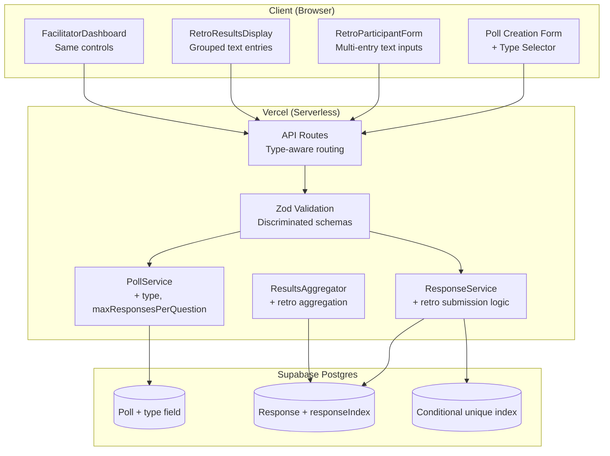
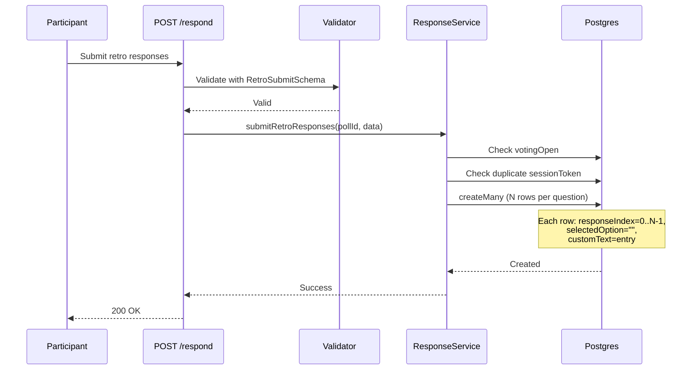
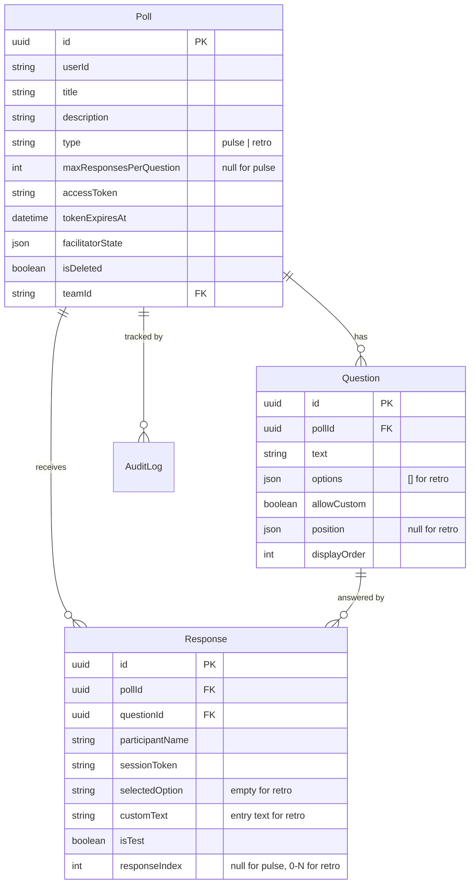

# Design Document: Retro Free-Text Responses

## Overview

This feature extends SprintPulse with a "retro" poll type that enables sprint retrospectives through free-text responses. Unlike existing "pulse" polls where participants select from predefined options, retro polls allow participants to submit multiple free-text entries per question/category (e.g., "What went well?", "What to improve?", "Action items").

The design maintains full backward compatibility with existing pulse poll functionality by using a type discriminator on the Poll model and conditional validation/storage logic throughout the stack.

### Key Design Decisions

1. **Type discriminator pattern:** A `type` field on the Poll model ("pulse" | "retro") drives conditional behavior across validation, submission, storage, and results aggregation. This avoids separate tables while keeping the domain model clean.

2. **Conditional unique index strategy:** Rather than modifying the existing unique constraint (which would break pulse polls), a new partial unique index is added for retro responses where `responseIndex IS NOT NULL`. The existing constraint continues to protect pulse polls where `responseIndex` is null.

3. **Response reuse over new table:** Retro responses reuse the existing `Response` model with `selectedOption = ""` and text stored in `customText`. This minimizes schema changes and allows shared aggregation infrastructure.

4. **maxResponsesPerQuestion on Poll:** Stored at the poll level (not per-question) for simplicity. All categories in a retro poll share the same limit.

5. **Discriminated Zod schemas:** Separate validation schemas for retro vs. pulse submissions, selected at runtime based on poll type. This keeps validation logic clear and type-safe.

## Architecture

### High-Level Architecture (Retro Extension)



### Retro Submission Flow



### Layer Responsibilities (Retro Additions)

| Layer | Retro Responsibility |
|-------|---------------------|
| **Validation** | Discriminated schemas: `RetroCreatePollSchema`, `RetroCreateQuestionSchema`, `RetroSubmitResponsesSchema` |
| **PollService** | Store `type` and `maxResponsesPerQuestion`; enforce type immutability |
| **ResponseService** | Multi-row insertion with `responseIndex`; retro-specific deduplication |
| **ResultsAggregator** | Group text entries by category; count-only vs. full-detail reveal |
| **Frontend** | `RetroParticipantForm`, `RetroResultsDisplay`, type selector in creation form |


## Components and Interfaces

### Backend Components

#### 1. Poll Service (Extended)

```typescript
// lib/services/pollService.ts — additions

interface CreatePollInput {
  title: string;
  description?: string;
  teamId?: string;
  tokenExpiresAt?: string | null;
  type?: 'pulse' | 'retro';              // NEW — defaults to "pulse"
  maxResponsesPerQuestion?: number;       // NEW — 1-10, defaults to 5 for retro
}

interface UpdatePollInput {
  title?: string;
  description?: string;
  backgroundImageUrl?: string;
  teamId?: string | null;
  tokenExpiresAt?: string | null;
  // NOTE: `type` is NOT included — immutable after creation
  // NOTE: `maxResponsesPerQuestion` can be updated for retro polls
  maxResponsesPerQuestion?: number;
}

interface PublicPollView {
  id: string;
  title: string;
  description: string | null;
  backgroundImageUrl: string | null;
  type: 'pulse' | 'retro';               // NEW
  maxResponsesPerQuestion: number | null; // NEW — null for pulse
  facilitatorState: { ... };
  questions: Array<{ ... }>;
}
```

**Behavior changes:**
- `createPoll`: Stores `type` (default "pulse") and `maxResponsesPerQuestion` (default 5 for retro, null for pulse)
- `updatePoll`: Rejects any attempt to change `type`; allows updating `maxResponsesPerQuestion` for retro polls
- `getPublicPoll` / `getPublicPollByToken`: Includes `type` and `maxResponsesPerQuestion` in response

#### 2. Response Service (Extended)

```typescript
// lib/services/responseService.ts — additions

interface RetroAnswer {
  questionId: string;
  entries: string[];  // 1 to maxResponsesPerQuestion text entries
}

interface SubmitRetroResponsesInput {
  participantName: string;
  sessionToken: string;
  answers: RetroAnswer[];
  isTest?: boolean;
}

interface ResponseService {
  // Existing
  submitResponses(pollId: string, data: SubmitResponsesInput): Promise<void>;
  hasSubmitted(pollId: string, sessionToken: string): Promise<boolean>;
  getResults(pollId: string, options: ResultOptions): Promise<AggregatedResults>;
  clearTestResponses(pollId: string): Promise<void>;

  // NEW
  submitRetroResponses(pollId: string, data: SubmitRetroResponsesInput): Promise<void>;
}
```

**`submitRetroResponses` logic:**
1. Fetch poll (with questions) and verify `type === 'retro'`
2. Check `facilitatorState.votingOpen === true`
3. Check no existing responses for this `sessionToken` + `pollId`
4. Validate all questions are answered (at least 1 entry each)
5. For each question, for each entry (index `i`):
   - Trim whitespace
   - Create Response row: `{ pollId, questionId, participantName, sessionToken, selectedOption: "", customText: trimmedEntry, responseIndex: i, isTest }`
6. Log audit entry

#### 3. Results Aggregator (Extended)

```typescript
// Within responseService.getResults — retro-specific aggregation

interface RetroQuestionResult {
  questionId: string;
  questionText: string;
  options: [];                    // Always empty for retro
  customResponses: CustomResponse[];
  totalResponses: number;        // Count of text entries for this category
}

// For COUNTS reveal stage (retro):
// - totalResponses = count of entries per category
// - customResponses = [] (no text revealed)
// - participantCount = distinct session tokens

// For DETAILS reveal stage (retro):
// - customResponses includes all entries ordered by createdAt ASC
// - Each entry has { text, participantLabel }
```

**Anonymisation for retro:**
- Build a stable participant ordering based on first submission time (earliest `createdAt` across all responses for a session token)
- Assign "Participant 1", "Participant 2", etc. based on this ordering
- Same label used across all categories within a single results response

#### 4. Retro Clipboard Export

```typescript
// lib/utils/retroExport.ts

interface RetroExportOptions {
  results: AggregatedResults;
  anonymise: boolean;
}

function formatRetroResultsForClipboard(options: RetroExportOptions): string;
```

**Output format:**
```
## What went well?
• Response text here — Participant 1
• Another response — Participant 2

## What to improve?
• Response text here — Participant 1
```

### Frontend Components

#### 1. Poll Type Selector

```typescript
// components/admin/PollTypeSelector.tsx
interface PollTypeSelectorProps {
  value: 'pulse' | 'retro';
  onChange: (type: 'pulse' | 'retro') => void;
  disabled?: boolean;  // true in edit mode
}
```

Renders a segmented control at the top of the poll creation form. Disabled (hidden) when editing an existing poll.

#### 2. RetroParticipantForm

```typescript
// components/participant/RetroParticipantForm.tsx
interface RetroParticipantFormProps {
  poll: PublicPollView;  // type === 'retro'
  facilitatorState: FacilitatorState;
  onSubmit: (data: SubmitRetroResponsesInput) => void;
}
```

Renders:
- Participant name input
- For each category (question):
  - Category heading (question text)
  - Dynamic list of text input fields (textarea)
  - "Add response" button (disabled when at `maxResponsesPerQuestion`)
  - Remove button on each entry (hidden when only 1 entry remains)
- Submit button
- Voting-closed banner when applicable

**State management:**
- Local state: `Record<questionId, string[]>` — entries per category
- Each category starts with 1 empty entry
- Add: push empty string to array (up to max)
- Remove: splice from array (minimum 1 entry)

#### 3. RetroResultsDisplay

```typescript
// components/results/RetroResultsDisplay.tsx
interface RetroResultsDisplayProps {
  results: AggregatedResults;
  revealStage: RevealStage;
  anonymise: boolean;
  onCopyAll?: () => void;
}
```

Renders:
- **HIDDEN**: "Results are hidden" message
- **COUNTS**: Per-category entry count + participant count (no text)
- **DETAILS**: All text entries grouped by category with participant labels
- "Copy all to clipboard" button (visible at DETAILS stage)

#### 4. FacilitatorDashboard (Extended)

The existing `FacilitatorDashboard` component is extended to:
- Detect poll type and render `RetroResultsDisplay` for retro polls
- Show "Total Entries" instead of "Submissions" in the stats panel for retro polls
- All toggle controls remain identical

### API Route Changes

The existing API routes handle both poll types through the type discriminator:

| Route | Change |
|-------|--------|
| `POST /api/polls` | Accept `type` and `maxResponsesPerQuestion` in body |
| `PATCH /api/polls/[id]` | Reject `type` changes; allow `maxResponsesPerQuestion` updates for retro |
| `POST /api/polls/[id]/questions` | Use retro question schema when poll type is "retro" |
| `POST /api/polls/[id]/respond` | Detect poll type → dispatch to `submitResponses` or `submitRetroResponses` |
| `GET /api/polls/[id]/results` | Aggregation logic branches on poll type |
| `GET /api/polls/[id]/public` | Include `type` and `maxResponsesPerQuestion` in response |

**Respond route dispatch logic:**
```typescript
// POST /api/polls/[id]/respond
const poll = await pollService.getPublicPoll(id);
if (poll.type === 'retro') {
  const result = RetroSubmitResponsesSchema.safeParse(body);
  if (!result.success) return validationError(...);
  await responseService.submitRetroResponses(id, result.data);
} else {
  const result = SubmitResponsesSchema.safeParse(body);
  if (!result.success) return validationError(...);
  await responseService.submitResponses(id, result.data);
}
```


## Data Models

### Prisma Schema Changes

```prisma
model Poll {
  id                       String     @id @default(uuid())
  userId                   String
  title                    String     @db.VarChar(200)
  description              String?    @db.VarChar(1000)
  backgroundImageUrl       String?
  accessToken              String     @unique @db.VarChar(64)
  tokenExpiresAt           DateTime?
  type                     String     @default("pulse") @db.VarChar(10)  // NEW: "pulse" | "retro"
  maxResponsesPerQuestion  Int?       // NEW: 1-10, null for pulse, default 5 for retro
  facilitatorState         Json       @default("{\"_v\":1,\"votingOpen\":false,\"liveResults\":false,\"anonymise\":true,\"revealStage\":\"HIDDEN\"}")
  isDeleted                Boolean    @default(false)
  teamId                   String?
  createdAt                DateTime   @default(now())
  updatedAt                DateTime   @updatedAt

  team                     Team?      @relation(fields: [teamId], references: [id])
  questions                Question[]
  responses                Response[]
  auditLogs                AuditLog[]

  @@index([userId])
  @@index([teamId])
  @@index([accessToken])
}

model Response {
  id              String   @id @default(uuid())
  pollId          String
  questionId      String
  participantName String   @db.VarChar(50)
  sessionToken    String
  selectedOption  String
  customText      String?  @db.Text
  isTest          Boolean  @default(false)
  responseIndex   Int?     // NEW: null for pulse, 0-based for retro
  createdAt       DateTime @default(now())
  updatedAt       DateTime @updatedAt

  poll            Poll     @relation(fields: [pollId], references: [id])
  question        Question @relation(fields: [questionId], references: [id])

  @@index([pollId])
  @@index([questionId])
  @@index([sessionToken])
  @@unique([pollId, questionId, sessionToken])  // Existing: protects pulse (responseIndex=null)
}
```

### Database Migration

```sql
-- Add type column to Poll (non-nullable with default)
ALTER TABLE "Poll" ADD COLUMN "type" VARCHAR(10) NOT NULL DEFAULT 'pulse';

-- Add maxResponsesPerQuestion to Poll (nullable)
ALTER TABLE "Poll" ADD COLUMN "maxResponsesPerQuestion" INTEGER;

-- Add responseIndex to Response (nullable)
ALTER TABLE "Response" ADD COLUMN "responseIndex" INTEGER;

-- Add conditional unique index for retro responses
CREATE UNIQUE INDEX "Response_retro_unique"
  ON "Response" ("pollId", "questionId", "sessionToken", "responseIndex")
  WHERE "responseIndex" IS NOT NULL;
```

**Constraint strategy:**
- The existing `@@unique([pollId, questionId, sessionToken])` continues to protect pulse polls. Since pulse responses have `responseIndex = null`, and PostgreSQL treats nulls as distinct in unique constraints, this constraint effectively only fires for pulse responses (one row per question per session).
- The new conditional unique index `Response_retro_unique` protects retro responses by ensuring no duplicate `(pollId, questionId, sessionToken, responseIndex)` combinations where `responseIndex IS NOT NULL`.

### Updated ER Diagram



### Validation Schemas (Zod)

```typescript
// lib/validators/schemas.ts — new schemas

/**
 * Extended CreatePollSchema with type discriminator.
 */
export const CreatePollSchema = z.object({
  title: z.string().min(1).max(200),
  description: z.string().max(1000).optional(),
  teamId: z.string().uuid().optional(),
  tokenExpiresAt: z.string().datetime().nullable().optional(),
  type: z.enum(['pulse', 'retro']).default('pulse'),
  maxResponsesPerQuestion: z.number().int().min(1).max(10).optional(),
});

/**
 * Schema for creating a question in a retro poll.
 * Options must be an empty array; allowCustom is implicitly true.
 */
export const RetroCreateQuestionSchema = z.object({
  text: z.string().min(1).max(500),
  options: z.array(z.string()).max(0),  // Must be empty
  allowCustom: z.boolean().default(true),
  position: z.null().default(null),     // No canvas for retro
  displayOrder: z.number().int().min(0),
});

/**
 * Schema for a single retro answer (multiple text entries per question).
 */
export const RetroAnswerSchema = z.object({
  questionId: z.string().uuid(),
  entries: z.array(
    z.string()
      .transform(s => s.trim())
      .pipe(z.string().min(1, 'Entry cannot be empty').max(2000))
  ).min(1, 'At least one entry required'),
  // maxResponsesPerQuestion validated at service level (needs poll context)
});

/**
 * Schema for submitting retro responses.
 */
export const RetroSubmitResponsesSchema = z.object({
  participantName: z.string().min(2).max(50),
  sessionToken: z.string().uuid(),
  answers: z.array(RetroAnswerSchema).min(1),
  isTest: z.boolean().default(false),
});

// Inferred types
export type RetroAnswer = z.infer<typeof RetroAnswerSchema>;
export type SubmitRetroResponsesInput = z.infer<typeof RetroSubmitResponsesSchema>;
```


## Correctness Properties

*A property is a characteristic or behavior that should hold true across all valid executions of a system — essentially, a formal statement about what the system should do. Properties serve as the bridge between human-readable specifications and machine-verifiable correctness guarantees.*

### Property 1: Invalid poll type rejection

*For any* string value that is not "pulse" or "retro", the poll creation validator SHALL reject the request with a validation error.

**Validates: Requirements 1.3**

### Property 2: maxResponsesPerQuestion range validation

*For any* integer value less than 1 or greater than 10, the retro poll creation validator SHALL reject the request with a validation error indicating the allowed range.

**Validates: Requirements 1.6**

### Property 3: maxResponsesPerQuestion ignored for pulse polls

*For any* poll creation request with type "pulse" that includes a maxResponsesPerQuestion value, the persisted poll SHALL have maxResponsesPerQuestion as null.

**Validates: Requirements 1.7**

### Property 4: Poll type immutability

*For any* existing poll (pulse or retro), an update request that includes a type field SHALL be rejected, and the poll's type SHALL remain unchanged.

**Validates: Requirements 1.8, 10.4**

### Property 5: Retro question requires empty options array

*For any* question creation request on a retro poll where the options array contains one or more elements, the validator SHALL reject the request.

**Validates: Requirements 2.2, 2.3**

### Property 6: Retro entry count validation

*For any* retro poll with maxResponsesPerQuestion = M, and any submission where a question has N entries: the submission SHALL be accepted if 1 ≤ N ≤ M, and rejected if N > M or N < 1.

**Validates: Requirements 3.1, 3.2, 3.3**

### Property 7: Retro entry text validation

*For any* retro response entry that is empty or whitespace-only after trimming, the validator SHALL reject it. *For any* entry whose trimmed length exceeds 2000 characters, the validator SHALL reject it.

**Validates: Requirements 3.4, 3.5**

### Property 8: Retro entry whitespace trimming

*For any* retro response entry string with leading or trailing whitespace, the persisted customText value SHALL equal the input string with leading and trailing whitespace removed.

**Validates: Requirements 3.6**

### Property 9: Retro response storage format

*For any* retro poll submission with N entries for a given question, the service SHALL create exactly N Response rows for that question, where each row has: responseIndex equal to its zero-based position (0, 1, ..., N-1), selectedOption equal to an empty string, and customText equal to the trimmed entry text.

**Validates: Requirements 3.7, 4.3, 4.6, 4.7**

### Property 10: Pulse poll responseIndex is null

*For any* pulse poll submission, all persisted Response rows SHALL have responseIndex equal to null.

**Validates: Requirements 4.2**

### Property 11: Retro duplicate session rejection

*For any* retro poll and any valid submission, submitting a second time with the same session token SHALL be rejected with a conflict error, and no additional Response rows SHALL be created.

**Validates: Requirements 3.9**

### Property 12: Retro voting gate

*For any* retro poll where facilitatorState.votingOpen is false, any submission attempt SHALL be rejected with a "Voting is currently closed" error.

**Validates: Requirements 3.10, 6.2**

### Property 13: Retro reveal stage HIDDEN returns empty results

*For any* retro poll with any number of responses, when the reveal stage is HIDDEN, the results SHALL return an empty questions array with participantCount of 0 and submissionCount of 0.

**Validates: Requirements 5.1**

### Property 14: Retro reveal stage COUNTS excludes text content

*For any* retro poll with responses, when the reveal stage is COUNTS, the results SHALL include the correct totalResponses count per category and the correct participantCount, but SHALL NOT include any customText content or participant labels.

**Validates: Requirements 5.2**

### Property 15: Retro reveal stage DETAILS includes all entries

*For any* retro poll with responses, when the reveal stage is DETAILS, the results SHALL include every submitted text entry grouped by category, with each entry containing its text and the associated participant label.

**Validates: Requirements 5.3**

### Property 16: Retro anonymisation label consistency

*For any* retro poll with anonymisation enabled, the same participant (session token) SHALL receive the same "Participant N" label across all categories within a single results response, and labels SHALL be assigned based on the order of first submission time (earliest first).

**Validates: Requirements 5.4, 5.9**

### Property 17: Retro results ordering by submission time

*For any* retro poll category with multiple responses, the entries SHALL be ordered by submission time (createdAt) ascending — earliest first.

**Validates: Requirements 5.7**

### Property 18: Retro text verbatim preservation

*For any* retro response text string (up to 2000 characters), the results aggregator SHALL return the exact text without truncation or modification.

**Validates: Requirements 5.6**

### Property 19: Clipboard export format correctness

*For any* set of retro results, the clipboard export SHALL format output with category headings followed by bulleted entries, and when anonymisation is enabled, SHALL use "Participant N" labels instead of real names.

**Validates: Requirements 9.2, 9.3**


## Error Handling

### Retro-Specific Error Cases

| HTTP Status | Code | When |
|-------------|------|------|
| 400 | `VALIDATION_ERROR` | Invalid type value, maxResponsesPerQuestion out of range, empty/whitespace entry, entry too long, too many entries, non-empty options on retro question |
| 400 | `TYPE_IMMUTABLE` | Attempt to change poll type after creation |
| 409 | `CONFLICT` | Duplicate session token submission on retro poll |
| 410 | `VOTING_CLOSED` | Retro submission while voting is closed |
| 400 | `VALIDATION_ERROR` | Missing entries for one or more retro categories |

### Error Response Examples

**Entry count exceeded:**
```json
{
  "error": {
    "code": "VALIDATION_ERROR",
    "message": "Maximum 5 entries per question exceeded",
    "details": [
      { "path": ["answers", 0, "entries"], "message": "Array must contain at most 5 element(s)" }
    ]
  }
}
```

**Whitespace-only entry:**
```json
{
  "error": {
    "code": "VALIDATION_ERROR",
    "message": "Invalid input",
    "details": [
      { "path": ["answers", 0, "entries", 2], "message": "Entry cannot be empty" }
    ]
  }
}
```

**Type change attempt:**
```json
{
  "error": {
    "code": "TYPE_IMMUTABLE",
    "message": "Poll type cannot be changed after creation"
  }
}
```

**Non-empty options on retro question:**
```json
{
  "error": {
    "code": "VALIDATION_ERROR",
    "message": "Invalid input",
    "details": [
      { "path": ["options"], "message": "Array must contain at most 0 element(s)" }
    ]
  }
}
```

### Error Handling Patterns

1. **Type-aware validation:** The respond route fetches the poll type before selecting the appropriate Zod schema. If the poll doesn't exist, returns 404 before validation.

2. **maxResponsesPerQuestion enforcement:** The Zod schema validates entry array length statically (min 1), but the upper bound (maxResponsesPerQuestion) is validated at the service level since it requires poll context. The service throws a `VALIDATION_ERROR` if exceeded.

3. **Transaction safety:** `submitRetroResponses` runs in a single Prisma transaction. If any validation fails mid-transaction (e.g., duplicate detection), the entire operation rolls back — no partial entries are persisted.

4. **Backward compatibility:** All existing error codes and response formats remain unchanged for pulse polls. The type discriminator only activates retro-specific validation when `poll.type === 'retro'`.

## Testing Strategy

### Testing Approach

The testing strategy uses a dual approach:

1. **Property-based tests** — Verify universal correctness properties across randomised inputs (minimum 100 iterations per property)
2. **Unit tests** — Verify specific examples, edge cases, and error conditions
3. **Integration tests** — Verify API routes, database interactions, and component integration

### Property-Based Testing

**Library:** [fast-check](https://github.com/dubzzz/fast-check) (already used in the project)

**Configuration:**
- Minimum 100 iterations per property test
- Each test tagged with: `Feature: retro-free-text-responses, Property {N}: {title}`
- Tests target the service layer (pure business logic) with mocked database access

**Key property test areas:**

| Property | Test Focus |
|----------|-----------|
| 1 | Type validation — generate random strings, verify only "pulse"/"retro" pass |
| 2 | maxResponsesPerQuestion range — generate integers, verify 1-10 accepted |
| 3 | Pulse ignores maxResponsesPerQuestion — generate values, verify null persisted |
| 4 | Type immutability — generate update payloads with type, verify rejection |
| 5 | Retro empty options — generate non-empty arrays, verify rejection |
| 6 | Entry count bounds — generate entry arrays of various lengths, verify acceptance/rejection |
| 7 | Entry text validation — generate whitespace/long strings, verify rejection |
| 8 | Whitespace trimming — generate padded strings, verify trim applied |
| 9 | Storage format — generate submissions, verify row structure |
| 10 | Pulse responseIndex null — generate pulse submissions, verify null |
| 11 | Duplicate rejection — submit twice, verify conflict |
| 12 | Voting gate — generate submissions with votingOpen=false, verify rejection |
| 13-15 | Reveal stage behavior — generate responses, verify output at each stage |
| 16 | Anonymisation consistency — generate multi-participant data, verify label stability |
| 17 | Ordering — generate timestamped responses, verify chronological order |
| 18 | Verbatim preservation — generate text up to 2000 chars, verify exact match |
| 19 | Clipboard format — generate results, verify structured output |

### Unit Tests

**Framework:** Vitest

**Focus areas:**
- Zod schema validation for retro-specific schemas (boundary values)
- `submitRetroResponses` business logic with mocked Prisma client
- Results aggregation branching for retro vs. pulse
- Clipboard export formatting
- Default value assignment (type defaults to "pulse", maxResponsesPerQuestion defaults to 5)
- Type immutability enforcement in updatePoll

### Integration Tests

**Framework:** Vitest + API route testing

**Focus areas:**
- Full retro poll creation → question creation → submission → results flow
- Conditional unique index enforcement (duplicate responseIndex rejection)
- Backward compatibility: existing pulse poll flows unchanged
- Mixed poll listing (pulse and retro polls coexist)
- Facilitator state controls applied to retro polls

### Component Tests

**Framework:** Vitest + React Testing Library

**Focus areas:**
- `RetroParticipantForm`: add/remove entries, max limit enforcement, submit payload structure
- `RetroResultsDisplay`: rendering at each reveal stage, anonymisation
- `PollTypeSelector`: toggle behavior, disabled state in edit mode
- Poll creation form: conditional UI based on type selection (options hidden, canvas hidden)
- Clipboard copy functionality

### Test Organisation

```
tests/
├── properties/
│   ├── retro-validation.prop.test.ts      # Properties 1-5, 7
│   ├── retro-submission.prop.test.ts      # Properties 6, 8-12
│   ├── retro-aggregation.prop.test.ts     # Properties 13-18
│   └── retro-export.prop.test.ts          # Property 19
├── unit/
│   ├── services/
│   │   ├── retro-response.test.ts
│   │   └── retro-poll.test.ts
│   ├── validators/
│   │   └── retro-schemas.test.ts
│   └── utils/
│       └── retro-export.test.ts
├── integration/
│   ├── retro-flow.test.ts
│   └── retro-backward-compat.test.ts
└── components/
    ├── RetroParticipantForm.test.tsx
    ├── RetroResultsDisplay.test.tsx
    └── PollTypeSelector.test.tsx
```
