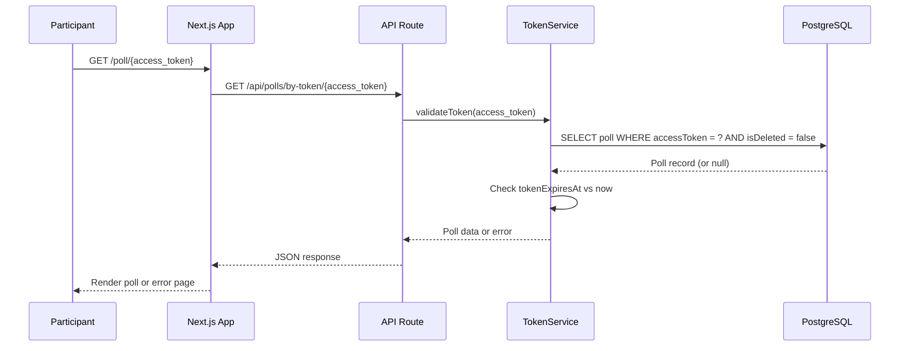

# Design Document: Secure Poll URL Access

## Overview

This feature replaces the existing team-based PIN access system with unique, cryptographically secure URLs per poll. Each poll receives a non-guessable access token embedded in its URL (`/poll/{access_token}`), and a corresponding QR code is generated for easy sharing during sessions. Participants access polls exclusively through these unique URLs — there is no global poll listing or discovery mechanism.

The design introduces a `TokenService` for access token lifecycle management, a `QRService` for QR code generation, modifies the participant routing from `/poll/[id]` to `/poll/[token]`, and removes the PIN-based access flow entirely.

### Key Design Decisions

1. **Access token stored on the Poll model** (new `accessToken` column): Keeps the data model simple — one token per poll, stored directly on the poll record. No separate token table needed since the relationship is 1:1.

2. **Token format: 32-character URL-safe base64**: Uses `crypto.randomBytes(24)` encoded as base64url (32 chars). This provides 192 bits of entropy — computationally infeasible to guess. URL-safe encoding avoids issues with path segments.

3. **Dynamic route change from `/poll/[id]` to `/poll/[token]`**: The participant page route changes to use the access token as the path parameter. This makes the URL itself the access credential — no separate validation step needed.

4. **QR code generated client-side**: Uses a lightweight library (`qrcode`) to generate QR codes on-demand in the browser. No server-side image storage needed. The QR simply encodes the poll URL.

5. **Optional expiry stored as nullable timestamp**: `tokenExpiresAt` on the Poll model. Null means no expiry. Validation checks this timestamp during token lookup.

6. **Team identifier becomes an organizational label**: The existing `teamId` field on Poll is retained for facilitator-side organization/filtering, but it no longer gates participant access. Participants access polls solely via their unique URL.

7. **Migration strategy**: A database migration adds the `accessToken` column and generates tokens for all existing polls. The old PIN-based participant flow and the public poll listing endpoint are removed.

## Architecture

```mermaid
graph TD
    subgraph "Participant Flow (New)"
        PU[Participant opens /poll/TOKEN] --> TV[Token Validation]
        TV -->|Valid & not expired| PP[Participant Page - Single Poll]
        TV -->|Invalid/expired/deleted| EP[Error Page]
        PP --> SR[Submit Response /api/polls/TOKEN/respond]
    end

    subgraph "Facilitator Flow"
        AD[Admin Dashboard] --> PD[Poll Details]
        PD --> URL[Poll URL Display + Copy]
        PD --> QR[QR Code Display + Download]
        PD --> RG[Regenerate Token Action]
        RG --> TS[TokenService.regenerateToken]
        AD --> PC[Poll Create/Edit]
        PC -->|Optional expiry, optional team| PA[/api/polls]
        PA --> TS2[TokenService.generateToken]
    end

    subgraph "Services"
        TS --> DB[(PostgreSQL)]
        TS2 --> DB
        TV --> DB
    end

    subgraph "Base /poll path"
        BP[/poll - no token] --> IM[Informational Message]
    end
```

### Request Flow: Participant Access



## Components and Interfaces

### TokenService (`lib/services/tokenService.ts`)

```typescript
export interface TokenService {
  /** Generate a new cryptographically secure access token */
  generateToken(): string;

  /** Validate a token and return the associated poll (checks expiry + deletion) */
  validateToken(token: string): Promise<ValidatedPoll | null>;

  /** Regenerate the access token for a poll (invalidates old token) */
  regenerateToken(pollId: string, userId: string): Promise<{ accessToken: string } | null>;

  /** Construct the full poll URL from a token */
  buildPollUrl(token: string): string;
}

export interface ValidatedPoll {
  id: string;
  title: string;
  description: string | null;
  backgroundImageUrl: string | null;
  facilitatorState: {
    votingOpen: boolean;
    liveResults: boolean;
    anonymise: boolean;
    revealStage: string;
  };
  questions: Array<{
    id: string;
    text: string;
    options: unknown;
    allowCustom: boolean;
    position: unknown;
    displayOrder: number;
  }>;
}
```

### QRService (`lib/services/qrService.ts`)

```typescript
export interface QRService {
  /** Generate a QR code as a PNG data URL for the given poll URL */
  generateQRCode(pollUrl: string): Promise<string>;

  /** Generate a QR code as a PNG buffer for download */
  generateQRCodeBuffer(pollUrl: string): Promise<Buffer>;
}
```

### Updated PollService additions

```typescript
// New/modified method signatures
createPoll(data: CreatePollInput, userId: string): Promise<Poll>;  // Now generates accessToken
clonePoll(id: string, userId: string): Promise<Poll | null>;       // Generates new accessToken for clone
getPublicPollByToken(token: string): Promise<PublicPollView | null>; // New: lookup by token
```

### API Routes

| Route | Method | Auth | Description |
|-------|--------|------|-------------|
| `/api/polls/by-token/[token]` | GET | None | Validate token and return poll data for participants |
| `/api/polls/by-token/[token]/respond` | POST | None | Submit responses using token-based access |
| `/api/polls/[id]/regenerate-token` | POST | Required | Regenerate access token for a poll |
| `/api/polls/[id]/qr` | GET | Required | Get QR code image for a poll |
| `/api/polls` | POST | Required | Create poll (now generates access token) |
| `/api/polls/[id]/clone` | POST | Required | Clone poll (generates new access token) |

**Removed routes:**
| Route | Reason |
|-------|--------|
| `/api/polls/public` (GET, no auth, returns list) | No longer needed — participants access single polls via token |
| `/api/teams/validate-pin` | PIN system replaced by URL access |

### Validation Schemas

```typescript
// New schemas
export const AccessTokenParamSchema = z.object({
  token: z.string().min(32).max(64),
});

export const TokenExpirySchema = z.object({
  tokenExpiresAt: z.string().datetime().nullable().optional(),
});

// Updated CreatePollSchema — teamId becomes optional, add optional expiry
export const CreatePollSchema = z.object({
  title: z.string().min(1).max(200),
  description: z.string().max(1000).optional(),
  teamId: z.string().uuid().optional(),  // Changed from required to optional
  tokenExpiresAt: z.string().datetime().nullable().optional(),
});

// Updated UpdatePollSchema — add optional expiry
export const UpdatePollSchema = z.object({
  title: z.string().min(1).max(200).optional(),
  description: z.string().max(1000).optional(),
  backgroundImageUrl: z.string().url().optional(),
  teamId: z.string().uuid().nullable().optional(),
  tokenExpiresAt: z.string().datetime().nullable().optional(),
});
```

### UI Components

| Component | Location | Purpose |
|-----------|----------|---------|
| `PollUrlDisplay` | `components/admin/PollUrlDisplay.tsx` | Shows poll URL with copy-to-clipboard button |
| `QRCodeDisplay` | `components/admin/QRCodeDisplay.tsx` | Renders QR code with download button |
| `TokenRegenerateButton` | `components/admin/TokenRegenerateButton.tsx` | Button to regenerate token with confirmation |
| `TokenExpiryField` | `components/admin/TokenExpiryField.tsx` | Optional expiry duration picker for poll forms |
| Updated `PollForm` | `components/admin/PollForm.tsx` | Add expiry field, make team optional |
| Updated Participant Page | `app/poll/[token]/page.tsx` | Single-poll view accessed via token |
| New Base Poll Page | `app/poll/page.tsx` | Informational message (no listing) |

## Data Models

### Poll (updated Prisma model)

```prisma
model Poll {
  id                 String     @id @default(uuid())
  userId             String
  title              String     @db.VarChar(200)
  description        String?    @db.VarChar(1000)
  backgroundImageUrl String?
  accessToken        String     @unique @db.VarChar(64)
  tokenExpiresAt     DateTime?
  facilitatorState   Json       @default("{\"_v\":1,\"votingOpen\":false,\"liveResults\":false,\"anonymise\":true,\"revealStage\":\"HIDDEN\"}")
  isDeleted          Boolean    @default(false)
  teamId             String?
  createdAt          DateTime   @default(now())
  updatedAt          DateTime   @updatedAt

  team               Team?      @relation(fields: [teamId], references: [id])
  questions          Question[]
  responses          Response[]
  auditLogs          AuditLog[]

  @@index([userId])
  @@index([teamId])
  @@index([accessToken])
}
```

**New fields:**
- `accessToken` — unique, non-nullable, indexed. 32-character URL-safe base64 string.
- `tokenExpiresAt` — nullable DateTime. When set, the token becomes invalid after this timestamp.

### Token Generation Algorithm

```typescript
import crypto from 'crypto';

function generateToken(): string {
  // 24 random bytes → 32 characters in base64url encoding
  // Provides 192 bits of entropy
  return crypto.randomBytes(24).toString('base64url');
}
```

The base64url encoding produces URL-safe characters (A-Z, a-z, 0-9, -, _) without padding, making it safe for use directly in URL path segments.

### Migration Plan

```sql
-- 1. Add accessToken column (nullable initially for migration)
ALTER TABLE "Poll" ADD COLUMN "accessToken" VARCHAR(64);
ALTER TABLE "Poll" ADD COLUMN "tokenExpiresAt" TIMESTAMP;

-- 2. Generate tokens for existing polls
UPDATE "Poll" SET "accessToken" = encode(gen_random_bytes(24), 'base64')
WHERE "accessToken" IS NULL;

-- 3. Make accessToken non-nullable and add unique constraint
ALTER TABLE "Poll" ALTER COLUMN "accessToken" SET NOT NULL;
CREATE UNIQUE INDEX "Poll_accessToken_key" ON "Poll"("accessToken");
CREATE INDEX "Poll_accessToken_idx" ON "Poll"("accessToken");

-- 4. Remove PIN-related infrastructure (optional, can be done in separate migration)
-- The Team model and teamId FK remain for organizational purposes
```

Note: The PostgreSQL `gen_random_bytes` + `encode` produces base64 (not base64url), so the actual migration will use a PL/pgSQL function or application-level script to generate proper base64url tokens.

## Correctness Properties

*A property is a characteristic or behavior that should hold true across all valid executions of a system — essentially, a formal statement about what the system should do. Properties serve as the bridge between human-readable specifications and machine-verifiable correctness guarantees.*

### Property 1: Token format and uniqueness

*For any* set of N generated access tokens, each token SHALL be at least 32 characters long, contain only URL-safe characters (A-Z, a-z, 0-9, -, _), and all tokens in the set SHALL be distinct.

**Validates: Requirements 1.1, 1.3, 2.2**

### Property 2: Token validation round-trip

*For any* poll with a stored access token (that is not deleted and not expired), validating that token SHALL return exactly the poll associated with it — the same poll ID, title, and questions.

**Validates: Requirements 3.1, 3.4**

### Property 3: Invalid token rejection

*For any* string that does not match a stored access token, OR matches a token belonging to a deleted poll, validation SHALL return null/error.

**Validates: Requirements 3.5, 3.6**

### Property 4: Token regeneration invalidates old token

*For any* poll, after regenerating its access token, the new token SHALL differ from the old token, the new token SHALL validate successfully, and the old token SHALL no longer validate.

**Validates: Requirements 6.1, 6.2**

### Property 5: Clone produces distinct token

*For any* poll that is cloned, the cloned poll's access token SHALL differ from the original poll's access token, and both tokens SHALL independently validate to their respective polls.

**Validates: Requirements 1.5**

### Property 6: URL construction determinism

*For any* valid access token string, the constructed Poll URL SHALL equal `{BASE_URL}/poll/{access_token}`, and extracting the token from a constructed URL SHALL yield the original token.

**Validates: Requirements 2.1**

### Property 7: QR code round-trip

*For any* valid poll URL, generating a QR code and decoding it SHALL yield the original poll URL. The generated QR code SHALL be a valid PNG image of at least 300x300 pixels.

**Validates: Requirements 5.1, 5.2, 5.5**

### Property 8: Expiry-based validation

*For any* access token with an expiry timestamp, IF the current time exceeds the expiry THEN validation SHALL fail. IF the current time is before or equal to the expiry THEN validation SHALL succeed (assuming the poll is not deleted). *For any* access token with no expiry (null), validation SHALL succeed regardless of time elapsed.

**Validates: Requirements 7.2, 7.3, 7.5**

### Property 9: Team filter correctness

*For any* facilitator with polls assigned to various team identifiers, filtering by a specific team identifier SHALL return exactly the non-deleted polls with that team identifier and no others.

**Validates: Requirements 8.3**

### Property 10: Team identifier independence from URL access

*For any* poll, regardless of whether it has a team identifier assigned or not, its access token SHALL validate successfully and grant participant access identically.

**Validates: Requirements 8.4**

## Error Handling

| Scenario | HTTP Status | Error Code | Message |
|----------|-------------|------------|---------|
| Invalid token format (too short) | 400 | VALIDATION_ERROR | "Invalid poll link format" |
| Token not found (no matching poll) | 404 | NOT_FOUND | "Poll not found or link is invalid" |
| Token belongs to deleted poll | 404 | NOT_FOUND | "This poll is no longer available" |
| Token has expired | 410 | TOKEN_EXPIRED | "This poll link has expired" |
| Regenerate token — poll not found | 404 | NOT_FOUND | "Poll not found" |
| Regenerate token — not owner | 403 | FORBIDDEN | "You do not own this poll" |
| Poll creation fails token generation | 500 | INTERNAL_ERROR | "Unable to generate access token" |
| QR code generation fails | 500 | INTERNAL_ERROR | "Unable to generate QR code" |

Error responses follow the existing pattern in `lib/api/errors.ts`:
```typescript
{ error: { code: string, message: string, details?: Record<string, string> } }
```

New error helper for expired tokens:
```typescript
export function tokenExpiredError(message = 'This poll link has expired'): NextResponse<ApiError> {
  return NextResponse.json(
    { error: { code: 'TOKEN_EXPIRED', message } },
    { status: 410 }
  );
}
```

## Testing Strategy

### Property-Based Tests (fast-check)

The project uses TypeScript with Vitest and already has `fast-check` as a dependency. Property-based tests will use fast-check with a minimum of 100 iterations per property.

Each property test will be tagged with:
```
// Feature: secure-poll-url-access, Property {N}: {title}
```

**Properties to implement as PBT:**
- Token format and uniqueness (Property 1)
- Token validation round-trip (Property 2)
- Invalid token rejection (Property 3)
- Token regeneration invalidates old (Property 4)
- Clone produces distinct token (Property 5)
- URL construction determinism (Property 6)
- QR code round-trip (Property 7)
- Expiry-based validation (Property 8)
- Team filter correctness (Property 9)
- Team identifier independence (Property 10)

### Unit Tests (Vitest)

- TokenService.generateToken — specific format examples
- TokenService.validateToken — valid, invalid, expired, deleted poll cases
- TokenService.regenerateToken — ownership check, token replacement
- QRService.generateQRCode — output format verification
- URL construction — specific examples with known base URLs
- Poll creation — verify accessToken is populated
- Poll cloning — verify new accessToken differs from source
- Migration script — verify all polls receive tokens

### Integration Tests

- Full flow: create poll → get URL → access as participant → submit response
- Token regeneration: access with old URL fails, new URL works
- Expiry: create poll with expiry → access before expiry succeeds → access after expiry fails
- Migration: existing polls become accessible via generated tokens
- Removal of old endpoints: `/api/polls/public` returns 404

### Test File Structure

```
tests/
  unit/
    services/
      tokenService.test.ts
      qrService.test.ts
    api/
      polls-by-token.test.ts
      polls-regenerate-token.test.ts
  property/
    tokenService.property.test.ts
    tokenValidation.property.test.ts
    qrService.property.test.ts
    urlConstruction.property.test.ts
    teamFiltering.property.test.ts
```
