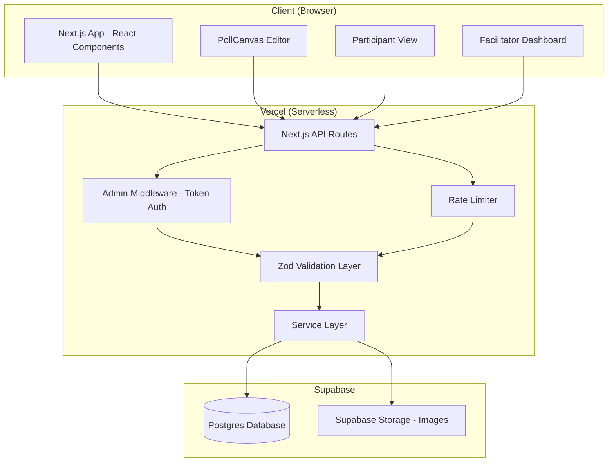
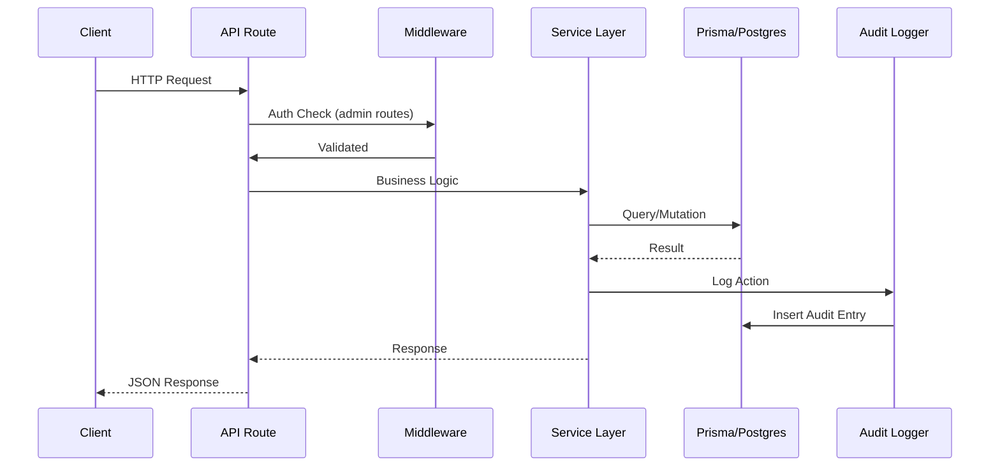
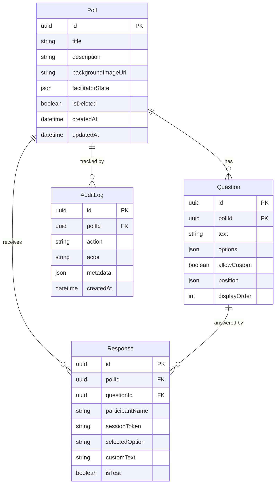

# Design Document: Shoprite-X Polling & Live Facilitation App

## Overview

The Shoprite-X Polling & Live Facilitation App is a web-based internal tool that enables facilitators to create visually rich polls, collect structured and free-text input, and control how and when results are revealed during live sessions (workshops, retrospectives, PI events, engagement sessions).

The system follows a client-server architecture built on Next.js 14+ (App Router) with Supabase Postgres as the persistence layer. The application is deployed on Vercel as serverless functions and static assets.

### Key Design Decisions

1. **Polling over WebSockets (Phase 1):** Client-side polling at 3-second intervals for live result updates. This simplifies deployment and avoids WebSocket connection management on serverless infrastructure. Supabase Realtime is deferred to Phase 3.

2. **Shared secret authentication (Phase 1):** Admin routes are gated by an `x-admin-token` header matching an environment variable. This avoids the complexity of user accounts while providing adequate protection for an internal tool.

3. **Percentage-based canvas coordinates:** Question positions are stored as percentages (0–100) relative to canvas dimensions, ensuring layout consistency across different screen sizes.

4. **JSON fields with versioned schemas:** `facilitatorState` and `question.position` use JSON columns with a `_v` key for forward-compatible schema evolution without destructive migrations.

5. **Soft deletes with retention purge:** Polls are soft-deleted (hidden from views) and hard-deleted after 30 days by an automated purge job, balancing data governance with accidental deletion recovery.

## Architecture

### High-Level Architecture



### Request Flow



### Layer Responsibilities

| Layer | Responsibility |
|-------|---------------|
| **API Routes** (`/app/api/`) | HTTP handling, request parsing, response formatting |
| **Middleware** | Admin token validation, rate limiting |
| **Validation** (`/lib/validators/`) | Zod schema validation for all inputs |
| **Service Layer** (`/lib/services/`) | Business logic, orchestration, audit logging |
| **Data Access** (`/lib/db/`) | Prisma client, queries, transactions |
| **Components** (`/components/`) | React UI components |

## Components and Interfaces

### Backend Components

#### 1. Admin Auth Middleware

```typescript
// middleware/adminAuth.ts
interface AdminAuthConfig {
  secret: string; // from ADMIN_SECRET env var
}

function withAdminAuth(handler: NextApiHandler): NextApiHandler;
```

Validates the `x-admin-token` header against `ADMIN_SECRET`. Returns 401 if missing or invalid.

#### 2. Rate Limiter

```typescript
// middleware/rateLimit.ts
interface RateLimitConfig {
  windowMs: number;      // 60_000 (1 minute)
  maxRequests: number;   // 60
}

function withRateLimit(handler: NextApiHandler, config?: RateLimitConfig): NextApiHandler;
```

In-memory sliding window rate limiter keyed by IP. Returns 429 when exceeded. Suitable for Phase 1 single-instance deployment.

#### 3. Poll Service

```typescript
// lib/services/pollService.ts
interface PollService {
  createPoll(data: CreatePollInput): Promise<Poll>;
  updatePoll(id: string, data: UpdatePollInput): Promise<Poll>;
  deletePoll(id: string): Promise<void>;  // soft delete
  clonePoll(id: string): Promise<Poll>;
  resetResponses(id: string): Promise<void>;
  getPoll(id: string): Promise<Poll | null>;
  listPolls(): Promise<Poll[]>;
  getPublicPoll(id: string): Promise<PublicPollView | null>;
}
```

#### 4. Question Service

```typescript
// lib/services/questionService.ts
interface QuestionService {
  createQuestion(pollId: string, data: CreateQuestionInput): Promise<Question>;
  updateQuestion(id: string, data: UpdateQuestionInput): Promise<Question>;
  deleteQuestion(id: string): Promise<void>;
  reorderQuestions(pollId: string, order: string[]): Promise<void>;
}
```

#### 5. Response Service

```typescript
// lib/services/responseService.ts
interface ResponseService {
  submitResponses(pollId: string, data: SubmitResponsesInput): Promise<void>;
  hasSubmitted(pollId: string, sessionToken: string): Promise<boolean>;
  getResults(pollId: string, options: ResultOptions): Promise<AggregatedResults>;
  clearTestResponses(pollId: string): Promise<void>;
}

interface ResultOptions {
  includeTest: boolean;
  revealStage: RevealStage;
  anonymise: boolean;
}
```

#### 6. Facilitator Service

```typescript
// lib/services/facilitatorService.ts
interface FacilitatorService {
  getState(pollId: string): Promise<FacilitatorState>;
  updateState(pollId: string, patch: Partial<FacilitatorState>): Promise<FacilitatorState>;
}

interface FacilitatorState {
  votingOpen: boolean;
  liveResults: boolean;
  anonymise: boolean;
  revealStage: RevealStage;
}

type RevealStage = 'HIDDEN' | 'COUNTS' | 'DETAILS';
```

#### 7. Audit Logger

```typescript
// lib/services/auditLogger.ts
interface AuditLogger {
  log(entry: AuditEntry): Promise<void>;
}

interface AuditEntry {
  pollId?: string;
  action: AuditAction;
  actor: string;
  metadata?: Record<string, unknown>;
}

type AuditAction =
  | 'POLL_CREATED' | 'POLL_UPDATED' | 'POLL_DELETED' | 'POLL_CLONED'
  | 'QUESTION_CREATED' | 'QUESTION_UPDATED' | 'QUESTION_DELETED'
  | 'RESPONSES_SUBMITTED' | 'RESPONSES_RESET'
  | 'FACILITATOR_SESSION_STARTED' | 'FACILITATOR_STATE_UPDATED'
  | 'REVEAL_STAGE_CHANGED' | 'VOTING_OPENED' | 'VOTING_CLOSED'
  | 'DATA_PURGED';
```

#### 8. Retention Service

```typescript
// lib/services/retentionService.ts
interface RetentionService {
  purge(): Promise<PurgeResult>;
}

interface PurgeResult {
  responsesDeleted: number;
  auditLogsDeleted: number;
  pollsHardDeleted: number;
}
```

#### 9. Validator Schemas (Zod)

```typescript
// lib/validators/schemas.ts
const CreatePollSchema = z.object({
  title: z.string().min(1).max(200),
  description: z.string().max(1000).optional(),
});

const CreateQuestionSchema = z.object({
  text: z.string().min(1).max(500),
  options: z.array(z.string().min(1)).min(2).max(10),
  allowCustom: z.boolean().default(false),
  position: PositionSchema.nullable().default(null),
  displayOrder: z.number().int().min(0),
});

const PositionSchema = z.object({
  x: z.number().min(0).max(100),
  y: z.number().min(0).max(100),
  width: z.number().min(0).max(100),
  height: z.number().min(0).max(100),
});

const SubmitResponsesSchema = z.object({
  participantName: z.string().min(2).max(50),
  sessionToken: z.string().uuid(),
  answers: z.array(AnswerSchema).min(1),
  isTest: z.boolean().default(false),
});

const AnswerSchema = z.object({
  questionId: z.string().uuid(),
  selectedOption: z.string().min(1),
  customText: z.string().max(2000).optional(),
});

const FacilitatorStateSchema = z.object({
  votingOpen: z.boolean().optional(),
  liveResults: z.boolean().optional(),
  anonymise: z.boolean().optional(),
  revealStage: z.enum(['HIDDEN', 'COUNTS', 'DETAILS']).optional(),
});
```

### Frontend Components

#### 1. PollCanvas (Admin Editor)

```typescript
// components/canvas/PollCanvas.tsx
interface PollCanvasProps {
  pollId: string;
  questions: Question[];
  backgroundImageUrl: string | null;
  onQuestionPositionChange: (questionId: string, position: Position) => void;
  onQuestionRemoveFromCanvas: (questionId: string) => void;
}
```

Renders the visual editor with:
- Background image (or grey placeholder)
- Draggable question cards on the canvas
- Sidebar with unplaced questions
- Corner resize handles on placed questions
- Right-click context menu for removal

#### 2. ParticipantForm

```typescript
// components/participant/ParticipantForm.tsx
interface ParticipantFormProps {
  poll: PublicPollView;
  facilitatorState: FacilitatorState;
  onSubmit: (responses: SubmitResponsesInput) => void;
}
```

Renders the participant voting interface:
- Name entry field
- Questions (canvas layout on desktop, list on mobile)
- Option selection with optional free-text
- Submit button with validation feedback
- Voting-closed banner when applicable

#### 3. FacilitatorDashboard

```typescript
// components/facilitator/FacilitatorDashboard.tsx
interface FacilitatorDashboardProps {
  pollId: string;
  poll: Poll;
  questions: Question[];
}
```

Renders the facilitator control panel:
- Toggle controls (voting, live results, anonymisation)
- Reveal stage selector
- Live participant/submission counts
- Results display (respects current reveal stage)
- Test responses tab

#### 4. ResultsDisplay

```typescript
// components/results/ResultsDisplay.tsx
interface ResultsDisplayProps {
  results: AggregatedResults;
  revealStage: RevealStage;
  anonymise: boolean;
}

interface AggregatedResults {
  questions: QuestionResult[];
  participantCount: number;
  submissionCount: number;
}

interface QuestionResult {
  questionId: string;
  questionText: string;
  options: OptionResult[];
  customResponses: CustomResponse[];
  totalResponses: number;
}

interface OptionResult {
  label: string;
  count: number;
  percentage: number;
}

interface CustomResponse {
  text: string;
  participantLabel: string; // anonymised or real name
}
```

### API Route Structure

```
/app/api/
├── polls/
│   ├── route.ts                    GET (list), POST (create)
│   └── [id]/
│       ├── route.ts                GET, PATCH, DELETE
│       ├── clone/route.ts          POST
│       ├── reset/route.ts          POST
│       ├── questions/
│       │   ├── route.ts            POST (create)
│       │   └── [qId]/route.ts     PATCH, DELETE
│       ├── facilitator/route.ts    GET, PATCH
│       ├── results/
│       │   ├── route.ts            GET (admin)
│       │   └── public/route.ts     GET (public, respects reveal)
│       ├── public/route.ts         GET (participant view)
│       └── respond/route.ts        POST (submit responses)
└── system/
    └── purge/route.ts              POST (cron-triggered)
```

## Data Models

### Prisma Schema

```prisma
generator client {
  provider = "prisma-client-js"
}

datasource db {
  provider = "postgresql"
  url      = env("DATABASE_URL")
}

model Poll {
  id                String     @id @default(uuid())
  title             String     @db.VarChar(200)
  description       String?    @db.VarChar(1000)
  backgroundImageUrl String?
  facilitatorState  Json       @default("{\"_v\":1,\"votingOpen\":false,\"liveResults\":false,\"anonymise\":true,\"revealStage\":\"HIDDEN\"}")
  isDeleted         Boolean    @default(false)
  createdAt         DateTime   @default(now())
  updatedAt         DateTime   @updatedAt

  questions         Question[]
  responses         Response[]
  auditLogs         AuditLog[]
}

model Question {
  id           String   @id @default(uuid())
  pollId       String
  text         String   @db.VarChar(500)
  options      Json     // string[]
  allowCustom  Boolean  @default(false)
  position     Json?    // {x, y, width, height} | null
  displayOrder Int
  createdAt    DateTime @default(now())
  updatedAt    DateTime @updatedAt

  poll         Poll       @relation(fields: [pollId], references: [id])
  responses    Response[]

  @@index([pollId])
}

model Response {
  id              String   @id @default(uuid())
  pollId          String
  questionId      String
  participantName String   @db.VarChar(50)
  sessionToken    String
  selectedOption  String
  customText      String?  @db.Text
  isTest          Boolean  @default(false)
  createdAt       DateTime @default(now())
  updatedAt       DateTime @updatedAt

  poll            Poll     @relation(fields: [pollId], references: [id])
  question        Question @relation(fields: [questionId], references: [id])

  @@index([pollId])
  @@index([questionId])
  @@index([sessionToken])
  @@unique([pollId, questionId, sessionToken])
}

model AuditLog {
  id        String   @id @default(uuid())
  pollId    String?
  action    String
  actor     String
  metadata  Json?
  createdAt DateTime @default(now())

  poll      Poll?    @relation(fields: [pollId], references: [id])

  @@index([pollId])
  @@index([createdAt])
}
```

### Key Data Relationships



### JSON Field Schemas

**facilitatorState (stored on Poll):**
```json
{
  "_v": 1,
  "votingOpen": false,
  "liveResults": false,
  "anonymise": true,
  "revealStage": "HIDDEN"
}
```

**question.position (nullable):**
```json
{
  "x": 25.5,
  "y": 10.0,
  "width": 20.0,
  "height": 15.0
}
```
All values are percentages (0–100) relative to canvas dimensions.

**question.options:**
```json
["Option A", "Option B", "Option C"]
```

### Unique Constraints and Deduplication

- `Response` has a unique constraint on `(pollId, questionId, sessionToken)` to prevent duplicate submissions per question from the same session.
- Session tokens are UUIDs generated client-side and stored in `localStorage`, keyed by poll ID.

### Image Storage

Background images are uploaded to Supabase Storage in a `poll-backgrounds` bucket. The URL is stored in `Poll.backgroundImageUrl`. Upload validation:
- Max size: 5 MB
- Allowed types: `image/jpeg`, `image/png`, `image/webp`
- File naming: `{pollId}/{timestamp}.{ext}`

## Correctness Properties

*A property is a characteristic or behavior that should hold true across all valid executions of a system — essentially, a formal statement about what the system should do. Properties serve as the bridge between human-readable specifications and machine-verifiable correctness guarantees.*

### Property 1: Poll creation round-trip

*For any* valid poll title (1–200 characters) and optional description (0–1000 characters), creating a poll and then listing all polls SHALL return a list containing a poll with that exact title and description.

**Validates: Requirements 1.1**

### Property 2: Image type validation accepts only allowed formats

*For any* file MIME type, the upload validator SHALL accept the file if and only if the type is one of `image/jpeg`, `image/png`, or `image/webp`.

**Validates: Requirements 1.5**

### Property 3: Poll reset removes all responses

*For any* poll with N responses (where N ≥ 0), resetting the poll SHALL result in zero responses remaining for that poll.

**Validates: Requirements 1.6**

### Property 4: Clone produces identical questions with zero responses and preserves original

*For any* poll with questions and responses, cloning SHALL produce a new poll where: (a) the title equals the original title suffixed with " (Copy)", (b) all questions are identical to the original, (c) the new poll has zero responses, and (d) the original poll's questions and responses remain unchanged.

**Validates: Requirements 1.7, 1.8**

### Property 5: Soft-deleted polls are hidden from views but retained in database

*For any* poll that is soft-deleted, it SHALL not appear in the admin poll list or public views, but SHALL still exist in the database with `isDeleted = true`.

**Validates: Requirements 1.9, 1.10**

### Property 6: Question count validation

*For any* integer N representing the number of questions in a poll, the validator SHALL accept the poll if and only if 1 ≤ N ≤ 20.

**Validates: Requirements 2.2**

### Property 7: Option count validation

*For any* integer N representing the number of predefined options on a question, the validator SHALL accept the question if and only if 2 ≤ N ≤ 10.

**Validates: Requirements 2.3**

### Property 8: Canvas z-index matches placement order

*For any* set of questions placed on the canvas, the rendered z-index of each question SHALL correspond to its placement order (last-placed has highest z-index).

**Validates: Requirements 3.11**

### Property 9: Session token persistence round-trip

*For any* valid participant name (2–50 characters) and poll ID, generating a session token and storing it in localStorage, then retrieving it, SHALL return the same participant name.

**Validates: Requirements 4.2, 4.3**

### Property 10: Incomplete submissions are rejected

*For any* submission where at least one question is unanswered, the validator SHALL reject the submission and no responses SHALL be persisted.

**Validates: Requirements 4.5, 4.10**

### Property 11: Duplicate submission prevention (idempotence)

*For any* valid submission, submitting the same poll with the same session token a second time SHALL be rejected, and the response count SHALL not increase.

**Validates: Requirements 4.8**

### Property 12: Facilitator state defaults

*For any* newly created poll, the facilitator state SHALL have `votingOpen = false`, `liveResults = false`, `anonymise = true`, and `revealStage = "HIDDEN"`.

**Validates: Requirements 5.1**

### Property 13: Anonymisation replaces all participant names

*For any* set of responses with participant names, when anonymisation is enabled, the rendered results SHALL contain zero occurrences of any real participant name and SHALL instead use sequential labels "Participant 1", "Participant 2", etc.

**Validates: Requirements 5.5, 7.5**

### Property 14: Facilitator state persistence round-trip

*For any* valid facilitator state (any combination of votingOpen, liveResults, anonymise, revealStage), saving and then retrieving the state SHALL return an equivalent state.

**Validates: Requirements 5.6**

### Property 15: Last-write-wins for concurrent state updates

*For any* two facilitator state updates applied sequentially, the persisted state SHALL equal the last update applied.

**Validates: Requirements 5.8**

### Property 16: Test responses excluded from public results and participant count

*For any* set of responses containing both test (isTest=true) and real (isTest=false) responses, the public results aggregation SHALL include only real responses in counts, percentages, and participant count.

**Validates: Requirements 6.2, 6.3, 6.7, 5.10**

### Property 17: Clearing test responses preserves real data

*For any* poll with a mix of test and real responses, clearing test responses SHALL remove all test-flagged responses while leaving all real responses unchanged.

**Validates: Requirements 6.5**

### Property 18: Results aggregation correctness

*For any* set of responses to a question, the computed count for each option SHALL equal the number of responses selecting that option, and the percentage SHALL equal (count / total) × 100.

**Validates: Requirements 7.1, 7.2**

### Property 19: Percentage sum invariant

*For any* question with at least one response, the sum of all option percentages SHALL be between 99% and 101% (inclusive).

**Validates: Requirements 7.3**

### Property 20: Free-text verbatim preservation

*For any* free-text response string, the displayed result SHALL contain the exact submitted text without truncation.

**Validates: Requirements 7.4**

### Property 21: Anonymised results contain no real names in output

*For any* set of responses where anonymisation is enabled, the complete rendered results output SHALL contain zero occurrences of any real participant name string.

**Validates: Requirements 7.5**

### Property 22: Free-text section hidden when no custom entries exist

*For any* question where no responses selected the custom option, the results output SHALL not include a free-text/custom section for that question.

**Validates: Requirements 7.8**

### Property 23: Audit log completeness

*For any* auditable action (poll CRUD, question CRUD, response submission, response reset, facilitator state change, voting toggle, reveal stage change, purge), executing the action SHALL produce a corresponding audit log entry with the correct action type, poll ID, and actor.

**Validates: Requirements 8.1, 8.2, 8.3, 8.4, 8.5, 8.6, 8.7, 8.8, 8.9, 8.10, 8.11, 8.12**

### Property 24: Audit log immutability

*For any* audit log entry, the record SHALL have a `createdAt` timestamp and SHALL NOT have an `updatedAt` field.

**Validates: Requirements 8.14**

### Property 25: Retention purge respects age thresholds

*For any* set of responses with varying creation dates, running the purge SHALL delete only those responses older than the configured threshold (default 90 days) and leave newer responses intact. The same policy applies to both test and real responses.

**Validates: Requirements 9.1, 9.6**

### Property 26: Audit log retention purge

*For any* set of audit log entries with varying creation dates, running the purge SHALL delete only those entries older than the configured threshold (default 365 days).

**Validates: Requirements 9.2**

### Property 27: Soft-deleted poll hard-deletion after grace period

*For any* soft-deleted poll, running the purge SHALL hard-delete the poll if and only if it was soft-deleted more than 30 days ago.

**Validates: Requirements 9.3**

### Property 28: Admin auth rejects invalid tokens

*For any* request to an admin API route where the `x-admin-token` header is missing or does not match `ADMIN_SECRET`, the system SHALL respond with 401 Unauthorized.

**Validates: Requirements 10.1, 10.3**

### Property 29: Admin auth accepts valid tokens

*For any* request to an admin API route where the `x-admin-token` header matches `ADMIN_SECRET`, the system SHALL not respond with 401.

**Validates: Requirements 10.2**

### Property 30: XSS sanitisation of free-text input

*For any* free-text input containing HTML tags or script elements, the sanitised output SHALL not contain executable script content or unsanitised HTML tags.

**Validates: Requirements 11.2**

### Property 31: ARIA labels on canvas-placed questions

*For any* question with a non-null canvas position, the rendered element SHALL include an `aria-label` attribute containing the question text.

**Validates: Requirements 13.3**

## Error Handling

### API Error Response Format

All API errors follow a consistent JSON structure:

```typescript
interface ApiError {
  error: {
    code: string;        // machine-readable error code
    message: string;     // human-readable description
    details?: unknown;   // validation errors or additional context
  };
}
```

### Error Categories

| HTTP Status | Code | When |
|-------------|------|------|
| 400 | `VALIDATION_ERROR` | Zod schema validation fails |
| 401 | `UNAUTHORIZED` | Missing or invalid admin token |
| 404 | `NOT_FOUND` | Poll or question does not exist (or is soft-deleted) |
| 409 | `CONFLICT` | Duplicate submission (same session token) |
| 410 | `VOTING_CLOSED` | Submission attempted while voting is closed |
| 429 | `RATE_LIMITED` | Rate limit exceeded |
| 500 | `INTERNAL_ERROR` | Unexpected server error |

### Error Handling Patterns

1. **Validation errors** return field-level details from Zod:
   ```json
   {
     "error": {
       "code": "VALIDATION_ERROR",
       "message": "Invalid input",
       "details": [
         { "path": ["title"], "message": "String must contain at most 200 character(s)" }
       ]
     }
   }
   ```

2. **Race conditions (voting closed mid-submission):** The submit endpoint checks `facilitatorState.votingOpen` at submission time. If closed, returns 410 with `VOTING_CLOSED`. No partial data is saved.

3. **Database connection failures:** Service layer catches Prisma connection errors, logs them, and returns 500. The client displays a "Connection lost" banner and retries with exponential backoff (initial: 1s, max: 30s, factor: 2).

4. **Image upload failures:** If Supabase Storage upload fails, the API returns 500 with a descriptive message. The poll is not created/updated (transaction rollback).

5. **Audit logging failures:** Audit logging is fire-and-forget within the same transaction. If the audit insert fails, the entire transaction rolls back to maintain consistency.

### Client-Side Error Handling

- **Network errors:** Display "Connection lost" banner with retry button
- **Validation errors (400):** Display inline field-level error messages
- **Auth errors (401):** Redirect to admin login prompt
- **Rate limiting (429):** Display "Too many requests, please wait" with countdown
- **Voting closed (410):** Disable submit, show banner, preserve form state for copy

## Testing Strategy

### Testing Approach

The testing strategy uses a dual approach:

1. **Property-based tests** — Verify universal correctness properties across randomised inputs (minimum 100 iterations per property)
2. **Unit tests** — Verify specific examples, edge cases, and error conditions
3. **Integration tests** — Verify API routes, database interactions, and component integration

### Property-Based Testing

**Library:** [fast-check](https://github.com/dubzzz/fast-check) (TypeScript property-based testing library)

**Configuration:**
- Minimum 100 iterations per property test
- Each test tagged with: `Feature: shoprite-x-polling-app, Property {N}: {title}`
- Tests target the service layer (pure business logic) with mocked database access

**Key property test areas:**
- Validation schemas (Properties 2, 6, 7)
- Results aggregation (Properties 16, 18, 19, 20, 21, 22)
- Facilitator state management (Properties 12, 14, 15)
- Data retention logic (Properties 25, 26, 27)
- Auth middleware (Properties 28, 29)
- Sanitisation (Property 30)
- Clone/reset operations (Properties 3, 4, 5)
- Session deduplication (Properties 10, 11)
- Anonymisation (Property 13)

### Unit Tests

**Framework:** Vitest

**Focus areas:**
- Zod schema validation (boundary values, edge cases)
- Service layer business logic with mocked Prisma client
- Audit logger action mapping
- Canvas position calculations
- Session token generation and validation
- Facilitator state transitions

### Integration Tests

**Framework:** Vitest + Supertest (for API route testing)

**Focus areas:**
- Full API route request/response cycles
- Admin auth middleware enforcement
- Rate limiting behavior
- Database persistence and retrieval
- Image upload to Supabase Storage
- Polling interval behavior for live results
- Concurrent submission handling

### Component Tests

**Framework:** Vitest + React Testing Library

**Focus areas:**
- PollCanvas drag-and-drop interactions
- ParticipantForm validation and submission flow
- FacilitatorDashboard control toggles
- ResultsDisplay rendering at different reveal stages
- Responsive layout breakpoints
- Accessibility (keyboard navigation, ARIA attributes, screen reader announcements)

### Test Organisation

```
tests/
├── properties/           # Property-based tests (fast-check)
│   ├── validation.prop.test.ts
│   ├── aggregation.prop.test.ts
│   ├── facilitator.prop.test.ts
│   ├── retention.prop.test.ts
│   ├── auth.prop.test.ts
│   ├── sanitisation.prop.test.ts
│   └── session.prop.test.ts
├── unit/                 # Unit tests
│   ├── services/
│   ├── validators/
│   └── utils/
├── integration/          # API integration tests
│   ├── polls.test.ts
│   ├── questions.test.ts
│   ├── responses.test.ts
│   ├── facilitator.test.ts
│   └── system.test.ts
└── components/           # React component tests
    ├── PollCanvas.test.tsx
    ├── ParticipantForm.test.tsx
    ├── FacilitatorDashboard.test.tsx
    └── ResultsDisplay.test.tsx
```

